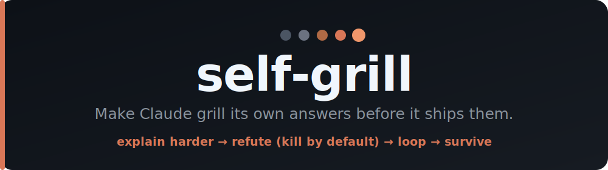

<div align="center">



<br>

<a href="https://claude.com/claude-code"></a>
<a href="LICENSE"></a>
<a href="https://github.com/TimoDeg/self-grill/stargazers"></a>
<a href="https://github.com/TimoDeg/self-grill/commits/main"></a>


<br><br>

**An LLM is the worst judge of its own answer.**<br>
`self-grill` makes Claude *explain its reasoning*, then hands it to a panel of **fresh agents told to assume it's wrong** — and prove it.<br>
Only claims that survive, **with sources**, get through.

<br>

<a href="#-install"><b>Install</b></a> &nbsp;·&nbsp;
<a href="#-use"><b>Use</b></a> &nbsp;·&nbsp;
<a href="#-how-it-works"><b>How it works</b></a> &nbsp;·&nbsp;
<a href="#-faq"><b>FAQ</b></a>

</div>

---

## The problem

Ask a model to check its own work and it defends what it just wrote — same context, sunk cost, confirmation bias. You get *more confident prose*, not *fewer mistakes*. Self-critique in one pass is theatre.

## The fix

Make the reasoning **explicit**, then have **someone else** break it — agents with zero stake in the wording, told to kill by default. It's [recursive criticism-and-improvement](#-how-it-works) with the one ingredient self-critique usually lacks: an **external objective** (sources, checkable facts) instead of the model's own narrative.

|                     | 🔴 Without `self-grill`             | 🟢 With `self-grill`                              |
| ------------------- | ----------------------------------- | ------------------------------------------------ |
| **Who judges**      | the author (defends itself)         | fresh agents, no sunk cost                        |
| **Default stance**  | "looks good to me"                  | "assume it's wrong — prove otherwise"             |
| **Claims**          | asserted                            | cited (`file:line` / URL / tool output) or flagged|
| **False premises**  | quietly absorbed                    | planted as traps, must be caught                  |
| **Output**          | a polished answer                   | a **KILLED list** — the bugs you'd have shipped   |

---

## ⚡ Install

`self-grill` is a single `SKILL.md`. Drop it where Claude Code looks for skills, then restart your session.

<details open>
<summary><b>🌍 Global</b> — every project on your machine</summary>

<br>

**macOS / Linux**
```bash
mkdir -p ~/.claude/skills/self-grill
curl -fsSL https://raw.githubusercontent.com/TimoDeg/self-grill/main/SKILL.md \
  -o ~/.claude/skills/self-grill/SKILL.md
```

**Windows (PowerShell)**
```powershell
$dir = "$env:USERPROFILE\.claude\skills\self-grill"
New-Item -ItemType Directory -Force $dir | Out-Null
Invoke-WebRequest -Uri "https://raw.githubusercontent.com/TimoDeg/self-grill/main/SKILL.md" -OutFile "$dir\SKILL.md"
```
</details>

<details>
<summary><b>📁 Per-project</b> — one repo only</summary>

<br>

```bash
mkdir -p .claude/skills/self-grill
curl -fsSL https://raw.githubusercontent.com/TimoDeg/self-grill/main/SKILL.md \
  -o .claude/skills/self-grill/SKILL.md
```
</details>

> 💡 Prefer no shell? Just download `SKILL.md` and drop it in `~/.claude/skills/self-grill/`.

---

## 🚀 Use

Type the slash command, optionally naming what to grill:

```text
/self-grill
/self-grill the migration plan you just gave me
```

…or just say a trigger phrase mid-conversation and Claude reaches for it:

> *"are you sure about that?"* &nbsp;·&nbsp; *"stop being lazy"* &nbsp;·&nbsp; *"did you hallucinate that number?"*<br>
> *"stress-test your reasoning"* &nbsp;·&nbsp; *"explain yourself harder"* &nbsp;·&nbsp; *"review your thinking"*

### What you get back

```text
RECEIPT — /self-grill on the deploy plan.   1 round (5 lenses) → xhigh judge.
Verdict: SURVIVES_REVISED (after 3 fixes).

KILLED / REVISED
  #1  major   "rollback is instant"   → wrong: migration is non-reversible, cited no source
  #2  minor   "p99 < 200ms"           → unverified ASSUMPTION, no benchmark behind it
  #3  minor   step 4 cited the wrong config file

TRAPS  — both planted false premises CAUGHT (not swallowed)

STILL ASSUMPTION (named, not buried)
  - load test ran on staging, not prod-sized data
```

The point isn't the polished answer — it's the **KILLED list**. Those are the bugs that would have shipped.

---

## 🔍 How it works

<div align="center">

```
                        /self-grill <answer or claim>
                                     │
        ┌────────────────────────────▼────────────────────────────┐
        │  1 · EXPLAIN HARDER                                      │
        │      rewrite as a ledger:  claim → why → source         │
        │      (no prose hand-waves; can't make it explicit = bug) │
        └────────────────────────────┬────────────────────────────┘
                                     │ ledger
        ┌────────────────────────────▼────────────────────────────┐
        │  2 · REFUTE JURY        (fresh agents · KILL by default) │
        │                                                         │
        │    unsourced · false-premise · lazy-leap ·              │
        │    contradiction · overconfident                        │
        │      haiku ─ haiku ─ sonnet ─ sonnet ─ opus             │
        │      (cheap lenses first, expensive lens on survivors)  │
        └────────────────────────────┬────────────────────────────┘
                                     │ findings + planted traps
        ┌────────────────────────────▼────────────────────────────┐
        │  3 · ANSWER BACK   fix · cite · downgrade · reject-w-why │
        │      catch every false premise — never absorb it        │
        └────────────────────────────┬────────────────────────────┘
                                     │
                    ┌────────────────┴────────────────┐
                    │  new defects?  yes → back to 2   │   (max 3 rounds)
                    │                no ×2 → xhigh judge│
                    └────────────────┬────────────────┘
                                     ▼
        ┌─────────────────────────────────────────────────────────┐
        │  RECEIPT:  SURVIVED · KILLED/REVISED · TRAPS · ASSUMPTIONS│
        └─────────────────────────────────────────────────────────┘
```

</div>

**Three rules do the work:**

| Rule | Kills |
| --- | --- |
| **Source-or-reject** — every claim needs a `file:line` / URL / tool output, else it's flagged `ASSUMPTION` | 🧠 hallucination |
| **KILL by default** — refuters are told *"assume it's wrong"*; ~97% of hand-waves don't survive | 😴 laziness |
| **Catch the false premise** — critics plant wrong facts in their questions; Claude must reject them | 🪞 sycophancy |

> **Generator ≠ decider.** The session that *wrote* the answer never gets the deciding vote — fresh agents with no stake in the wording do. That's why it's *agents*, not a second chat session.

---

## ❓ FAQ

<details>
<summary><b>Why agents instead of just opening a second chat?</b></summary>

<br>

A second chat session is manual, shares no state, and has no gate — pure overhead. Spawned agents run inside one session: the author *generates*, fresh agents *decide*. A fresh agent has no sunk cost in your phrasing, so it actually refutes instead of defending.
</details>

<details>
<summary><b>Doesn't this burn a lot of tokens?</b></summary>

<br>

Yes — on purpose. A multi-agent jury isn't free. Fire it on answers that matter (a plan you're about to execute, a number you'll cite, a hard-to-reverse call), not on every conversational turn. The skill says so itself.
</details>

<details>
<summary><b>Do I need the Workflow tool?</b></summary>

<br>

The jury uses Claude Code's **Workflow** tool for deterministic fan-out + looping. If your setup doesn't have it, the skill falls back to parallel **Agent (Task)** calls — same idea, you just lose the deterministic loop.
</details>

<details>
<summary><b>What's the "ground truth" it checks against?</b></summary>

<br>

Whatever's checkable for your claim: a cited `file:line`, a quoted tool/command output, a URL, a reproducible result. Recursive self-critique only helps when it improves against an *external* objective — not the model's own confidence. Claims with nothing behind them are flagged, not trusted.
</details>

---

## 📦 Requirements

- **[Claude Code](https://claude.com/claude-code)** — this is a Claude Code skill.
- **Workflow** tool for the deterministic jury (falls back to parallel **Agent** calls if absent).
- Tokens to spend — it spawns a multi-agent panel by design.

---

<div align="center">

### The one idea

Andrej Karpathy's **verification asymmetry**: *finding* a good answer is expensive, but *verifying* one is cheap.<br>
So don't spend compute on the model narrating its own confidence — spend it on adversarial verification against ground truth.<br>
`self-grill` is that idea wired into a repeatable pass.

<br>

**If this saved you from shipping a confident mistake, ⭐ the repo.**

<br>

Built for [Claude Code](https://claude.com/claude-code) · [MIT](LICENSE) — use it, fork it, ship it.

</div>
